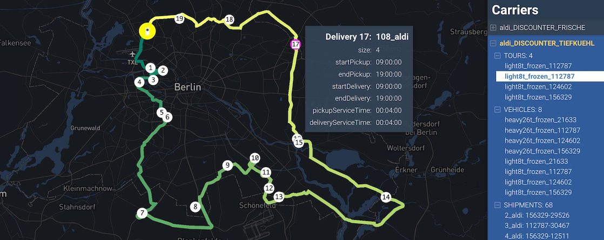

_MATSim carrier plans_

## Usage

TBA

A file named `viz-carrier*.yaml` must be present in working folder. Each yml file matching that pattern will produce a separate DRT visualization.

**viz-carrier-example.yml**

```yaml
title: "Dynamic Response Shared Taxis"
description: "Inaktive Sammeltaxis (Quadräte); Aktive Sammeltaxis (gelb)"
network: output_network.json.gz # slower: output_network.json.gz
carriers: output_carriers.xml.gz
center: [13.391, 52.515]
```

## YAML fields explained

**network:** both `.json.gz` and `xml.gz` network files are supported, but JSON-based files load _much_ faster.
**center:** Use this to force the map center point. `[long,lat]`
