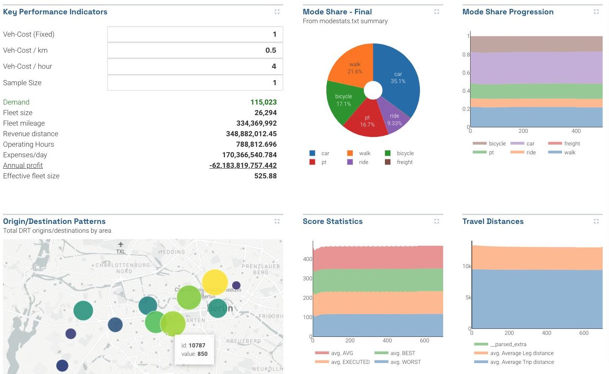

A dashboard is a page laid out with multiple charts, plots, and visualizations all together. You define the layout with a YAML configuration file which contains the types of plots and their configurations all in one place.


_Dashboards usually show several at-a-glance summary metrics._

A folder containing any number of `dashboard-*` YAML files show the dashboard instead of the usual folder browser view. When multiple dashboard YAML files exist, they will be shown as multiple navigation tabs on the page.

_Soon you will be able to define project-level dashboards, so that you don't have to copy the dashboard YAML files around. Stay tuned!_

## Defining a dashboard

Start with the example below and edit as necessary. YAML is extremely picky about white space and indentation, be careful!

**header:** A dashboard requires a header containg _tab_ and _title_ and optional _description._

```yaml
header:
  tab: "Summary"
  title: "Top-Level Summary Statistics"
  description: "At-a-glance figures we usually look at" #optional
```

**layout:** The layout consists of a set of named **rows**. The row name themselves are not shown anywhere, they are just there to help organize the file.

**row**: Each `row` consists of a list of chart objects. By default, all objects in the row will be laid out horizontally from left to right, in equal widths. (But see _width_ option further below)

```yaml
layout:
  row1: # this row has two charts
    - ...
    - ...
  row2: # next row has just one
    - ...
```

**Chart/plot details:** Finally, each element in a row has the following properties. This defines the actual chart that will be displayed.

- **type** The chart or plot type, e.g. `pie`, `bar`, `flowmap`, etc. See the individual chart docs for all available plots.
- **title** The name of the plot
- **description** A brief description (optional)
- **width** You can set _relative widths_ by adding the `width: [number]` property. Charts have a default width of 1. Thus in a row with 3 charts, if the width of the first object is 2, then [2+1+1] means the first object fills 50% of the row, and the remaining two objects fill 25% each. (optional)
- **props** The set of configuration settings for this chart, such as the dataset to load, which columns to use, etc. See the individual chart docs: _The chart type determines the set of valid properties!_

## Example: dashboard-summary.yaml

Here is a full example dashboard, pulling all of the above together. Note especially the indentation and the use of `-` to denote YAML lists.

```yaml
header:
  tab: Summary
  title: My Summary Dashboard
  description: "Examples of various chart types"

layout:
  row1: # this row has two charts
    - title: "Mode Share - Final"
      description: "From modestats.txt summary"
      type: "pie"
      width: 1
      props:
        dataset: "*modestats.txt"
        useLastRow: true
        ignoreColumns: ["Iteration"]

    - title: "Example Bar Plot"
      description: "Distance over Iteration"
      type: "bar"
      width: 2
      props:
        usedCol: [distance_m_mean, directDistance_m_mean]
        legendName: [Distance (mean), Direct Distance (mean)]
        skipFirstRow: true
        dataset: "*drt_customer_stats_drt_short.csv"
        x: "iteration"
        yAxisName: "Distanz"
        xAxisName: "Iteration"

  secondRow: # this row has just one
    - title: "Example Line Plot"
      description: "Distance over Iteration"
      type: "line"
      width: 1
      props:
        usedCol: [distance_m_mean, directDistance_m_mean]
        legendName: [Distance (mean), Direct Distance (mean)]
        skipFirstRow: false
        dataset: "*drt_customer_stats_drt.csv"
        x: "iteration"
        yAxisName: "Distance"
        xAxisName: "Iteration"
```
