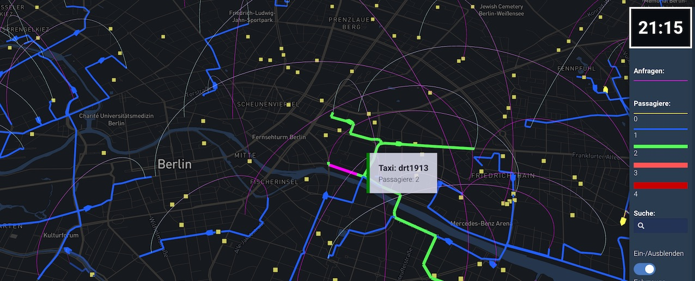

_Animation of DRT vehicle, paths, and passenger requests_

## Usage

A file named `viz-vehicle-*.yml` must be present in working folder. Each yml file matching that pattern will produce a separate DRT visualization.

**drt-example.yml**

```yaml
title: "Dynamic Response Shared Taxis"
description: Inaktive Sammeltaxis (Quadräte); Aktive Sammeltaxis (gelb)
drtTrips: drt-vehicles.json.gz
thumbnail: thumbnail-vehicles.jpg
center: [13.391, 52.515]
```

## YAML fields explained

**drtTrips:** the output from the [parse-drt-link-events.py](https://github.com/simwrapper/simwrapper.github.io/raw/source/scripts/parse-drt-link-events.py) script, gzipped for best performance

**center:** Use this to force the map center point. `[long,lat]`
