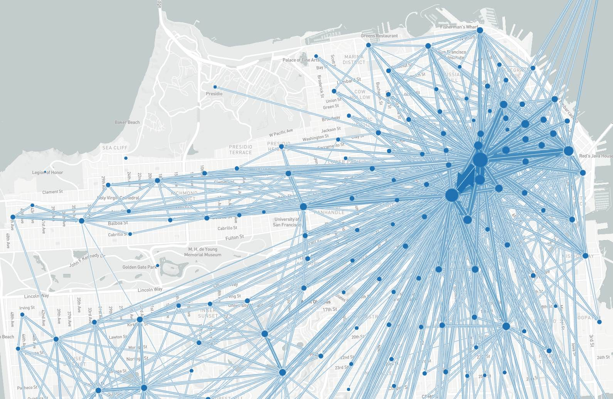

_A flow map of San Francisco_

Flowmaps depict _aggregate movements_ between origins and destinations.

## Usage

Flow maps can only be included as panels in **Dashboards**. See Dashboard documentation for general tips on creating dashboard configurations.

- Each chart panel is defined inside a **row** in a `dashboard-*.yaml` file.
- Standard title, description, height, and width fields define the frame.

---

### Sample dashboard.yaml config snippet

```yaml
layout:
  row1:
    - type: "flowmap"
      title: "Origin/Destination Flows"
      description: "Total daily trips"
      width: 2
      props:
        boundaries: "taz.geojson"
        boundariesJoinCol: "TAZ1454"
        boundariesLabels: "TAZ"
        dataset: "trip-od-flows.csv"
        origin: "origin"
        destination: "destination"
        flow: "trips"
```

---

### Flowmap properties

Each flowmap can have the following properties in the `props` section:

_THIS API IS CHANGING RAPIDLY, SORRY FOR ANY INCONSISTENCIES!_

**boundaries:** Geojson file with feature element boundaries.

**boundariesJoinCol:** The property in the boundary file containing the feature ID

**boundariesLabels:** The human readable name for the boundary ID column

**dataset:** CSV file containing at least three columns: origin, destination, and flow.

**origin:** The column name containing origin IDs

**destination:** The column name containing destination IDs

**flow:** The column name containing flow values
