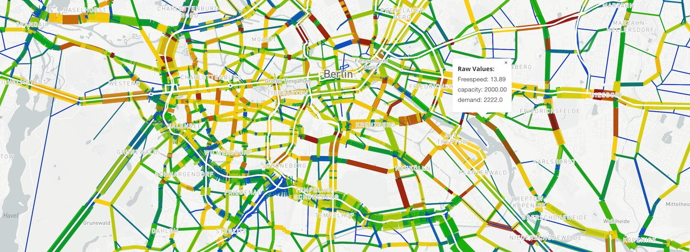

_Bandwidth plot_

Link bandwidth plot plugin. Supports regular bandwidth plots as well as difference and sum plots when comparing two alternatives.

## Usage

A file named `viz-gl-links-*.yml` must be present in working folder. Each yml file matching that pattern will produce a separate link volume diagram.

**viz-links-example.yml**

```yaml
title: "Passagieraufkommen in Sammeltaxis"
description: "Stündliches Passagieraufkommen in Sammeltaxis"
csvFile: "../base/hourlyTrafficVolume_passengers_VEHICLEFILTER-drt-vehicles.csv"
csvFile2: "Vu-DRT-1.link_hourlyTrafficVolume_passengers_VEHICLEFILTER-drt-vehicles.csv"
geojsonFile: ../vulkaneifel-network.geo.json.gz
widthFactor: 0.01
sampleRate: 0.25
thumbnail: thumbnail-roads.jpg
# deprecated:
shpFile: "vulkaneifel-network/vulkaneifel-network.shp"
dbfFile: "vulkaneifel-network/vulkaneifel-network.dbf"
shpFileIdProperty: "ID"
```

## YAML fields explained

---

**geojsonFile:** geojson-converted network file. Use the python script in `scripts/create-network.py` to create a geojson network from a matsim network.xml.gz file.

- Command is `python create-geojson-network.py [mynetwork.xml.gz] [Projection]`
- and will create a file with the name `mynetwork.geo.json.gz`.
- Note projection must be given! Format `EPSG:25832` etc.

**csvFile**: dataset, or "base" dataset for difference plots

**csvFile2:** (optional) "project" dataset for difference plots

**sampleRate:** MATSim simulation sample rate; i.e. a 1% sample should use `0.01` here so that volumes are scaled properly

**shpFile,dbfFile:** (deprecated) filenames for the alternative, slower network file in shapefile format. Don't use this if you have created the geojson network file above.

**shpFileIdProperty:** property name of field in Shapefile which contains area ID for linking shapefile regions to csvFile data.

Note: All filename fields can refer to parent folders using `../`.

- example: `geojsonFile: '../networks/base.json.gz'`

This works as far up the hierarchy as the base of the public-svn specified in `svnConfig.js` but no further.

---

## Required model output post-processing

**geojsonFile** - The standard MATSim network.xml.gz file is very inefficient and slow to load. Create the `geoJsonFile` network file using the following Python script:

- [create-network.py](https://simwrapper.github.io/docs/docs/scripts/create-network.py)
- You will need to install Python 3 to use this script.

**csvFile** - Use whatever method you like to produce a CSV for your data. The first line of the file should contain labels of the column names, e.g. the hour of the day, etc.

- First column must include the link ID, identical to the link ID in the network file
- All remaining columns will be available and will be labeled accordingly. The viz will also produce a sum "total" automatically

**example-data.csv**

```
link;01:00:00;02:00:00;03:00:00;04:00:00;05:00:00;06:00:00;07:00:00;08:00:00;09:00:00;10:00:00;11:00:00;12:00:00;13:00:00;14:00:00;15:00:00;16:00:00;17:00:00;18:00:00;19:00:00;20:00:00;21:00:00;22:00:00;23:00:00;24:00:00;25:00:00;26:00:00;27:00:00;28:00:00;30:00:00
72539930;0;0;0;0;7;13;20;16;13;15;18;17;32;25;29;55;53;43;48;12;12;10;4;4;4;0;0;0;0
42868713;0;0;0;0;0;0;0;0;0;0;0;0;0;1;0;0;1;1;0;0;0;0;0;0;0;0;0;0;0
72539936;0;1;0;0;17;57;63;52;51;47;49;59;78;67;73;113;99;98;107;47;38;36;24;13;4;0;0;0;0
6173553;0;1;0;3;5;1;10;10;9;3;8;4;6;3;4;9;5;7;4;2;1;1;1;2;0;1;0;0;0
```
