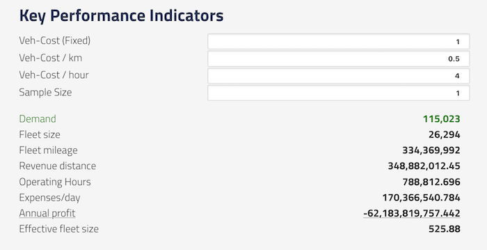

_Example "topsheet" calculation table_

## Introduction

You can create and display a simple table of calculations based on the CSV and XML data files in run folders. This can be useful for generating summary statistics, key performance indicators, etc.

A calculation table is defined in a YAML file which must be named `topsheet-*.yaml`. A separate table will be displayed for every topsheet\*.yaml file found in a run folder.

### Project-level ".topsheets" folders

Topsheet definition files can also be saved in a folder named `.topsheets` **anywhere above the current run folder** in the folder hierarchy.

All topsheets found in the folder tree will be displayed if possible; if duplicate names are found in higher levels, the topsheet definition found in the closest level to the current folder will be the one created.

## Example calculation table

```yaml
# Topsheet Test
title: Summary: Key Performance Indicators

# Input files -------------------------
files:
  customers:
    file: "*customer_stats_drt.csv"    # note wildcard
    useLastRow: true                   # useLastRow: only save the last row of this CSV;
                                       # good for modestats.txt, etc
  personMoneyEvents:
    file: "*personMoneyEventsSums.tsv" # The entire CSV is be saved as an array of
                                       # key:value objects
  drtVehicles:
    file: "*drt_vehicles.xml.gz"       # This is an XML file.
    xmlElements: 'vehicles.vehicle'    # Create an array from all <vehicle> tags which
                                       # are inside the <vehicles> tag

# USER ENTRIES ------------------------
# These are text entry boxes in the UI,
# with default values that can be edited by the user
userEntries:
  vehCost_fix:
    title_en: Veh-Cost (Fixed)
    title_de: Veh-Cost (Fixed)
    value: 1.0
  vehCost_km:
    title_en: Veh-Cost / km
    title_de: Veh-Cost / km
    value: 0.50
  sampleSize:
    title: "Sample Size"
    value: 0.10

# Calculations --------------------------------------------
# These are calculated as if in a script, from top to bottom.
# The language is very simple, you generally can only
# do one operation per line. Thus you will probably need
# to calculate a few intermediate variables which can
# be referenced in later lines. Then output the final
# values in the "outputs" section, below.

calculations:
  # Constants first
  userCost_km: 0.25
  userCost_fix: 3.00
  # {Brackets} refer to data value substitutions.

  # rides: from the customers data, get the value of the rides column
  # Note the customers file had "useLastRow" set to true, so it will only use the final
  # values found in that CSV
  rides: '{customers.rides}'

  # In general, if a calculation inside {brackets} refers to an array, the calculation will
  # return the SUM of whatever values that expression refers to.

  # opHours: the drtVehicles file is an array of elements that each have t_1 and t_0.
  # This eqn takes the SUM of all t_1 values, subtracts the SUM of all t_0 values,
  # and divides this by 3600
  opHours: '( {drtVehicles.t_1} - {drtVehicles.t_0}) / 3600'

  # operatingHours: this takes the value of opHours just calculated and
  # multiplies it by the sampleSize found in the UI entry fields
  operatingHours: 'opHours * sampleSize ^ (-0.662)'

  # drtFares: This uses the @filter function to select a subset of the rows in the CSV.
  # drtFares will be an array of rows from personMoneyEvents data where
  # the purpose field equals the string "drtFare"
  drtFares: '@filter(personMoneyEvents.purpose == drtFare)'

  # userFare: drtFares above is an array, so this will be the SUM of the values in the
  # sumAmount column of that filtered dataset.
  userFare: '{drtFares.sumAmount}'

  # the round() function does just that.
  # Any functions from the Nerdamer library are valid:
  # https://nerdamer.com/documentation.html
  fleetMileage: 'round(totalDistance * sampleSize ^ (-0.928))'

  expensesPerDay: 'fleetSize*vehCost_fix + fleetMileage*vehCost_km + operatingHours*vehCost_hour'
  annualProfit: '365 * (incomePerDay - expensesPerDay)'

# Table rows ---------------------------
# These values (calculated above) will actually be shown in the table.
# Use "title" if you only need one language, otherwise set title_en and title_de

# style can use any CSS property, most likely you will only need
# color, backgroundColor, textDecoration, fontWeight

outputs:
  - title_en: Demand
    title_de: Nachfrage
    value: demand
    style: { color: green}

  - title: Fleet size
    value: fleetSize

  - title_en: Annual profit
    title_de: Annual profit
    value: annualProfit
    style: { textDecoration: underline }

  - title_en: Effective fleet size
    title_de: Effective fleet size
    value: effectiveFleetSize
```

## Detailed usage guide

A topsheet config is specified in YAML and each top-level section has a specific purpose.

**title:** The title of the summary table. You can use `title` or a combination of `title_en` and `title_de`.

**files:** Each key in this section will be the name of a dataset that can be accessed in the calculations below.

- Specify the `file` name pattern, which can include an asterisk to select a pattern if necessary. The _first file that matches the pattern_ will be used.
- `useLastRow` can be used to drop all rows except the final row. This is useful for some standard MATSim output files such as `modestats.txt` if you only care about the values in the final iteration.

**userEntries:** Each key in this section is the name of a field that will appear at the top of the table, with a default value. The value of that field can then be used in the calculations below.

- `title` or `title_en` and `title_de` will be the label for the input entry.
- `value` is the default value, pre-filled in the form

**calculations:** is a top-down list of calculations that will be performed in the order they appear. You can perform calculations on the values in the files and input entries above. This language is not very sophisticated so you will probably need to create multiple intermediate calculations if you need something complex. See below for more details on the calculation engine.

If you cannot specify your calculation using this language, perhaps you need to run your own post-processing script to generate a simple CSV with the values you need. And then read that CSV file in, instead!

**outputs:** each element of this list will be an output row in the UI table.

- `value` should be the name of one of the calculated values, above. No calculations can be done here!
- `title` or both `title_en` and `title_de` will be the label for this value
- `style` can optionally include CSS styling properties, if you would like this row to be bold, green, etc. You can use any CSS valid styling properties in camelCase format, including typical values such as:
  - `color: red` for text color. Color names and #hexcodes are valid
  - `backgroundColor: yellow` for highlighting the background color of the entire row
  - `fontWeight: bold` for bold text
  - `textAlign: right` for left, right, center aligned values
  - `textDecoration: underline` for underlining
  - Feel free to experiment with other CSS styling!

### The calculation engine

Calculations are based on the [Nerdamer javascript calculation engine](https://nerdamer.com/), which is pretty advanced but doesn't know anything about our datasets, so we built a simple substitute/replace language which grabs values from the data files before sending the equations to the Nerdamer engine for evaluation.

Every line takes the form:

    variableName: 'equation + with + variables + etc'

where equation components can be constants, values retrieved from the UI form, variables already calculated, or lookups from the loaded data files. Typical math and logic operators such as `+,-,*,/,^` are all supported.

**Constants:** are simple, you define the name and the value.

`sampleRate: 0.25`

**UI Entry Fields:** you can refer to values entered in any UI fields directly by name.

`ridership: 'sampleRate * totalRiders'`

**Filtering datasets:** You can filter a dataset and save that selection as a new variable name using **@filter()**. Useful if you are only interested in a subset of rows.

`selectedRows: @filter(filename.column == value)`

will return an array of rows for which the value in the specified file's column matches the logical expression.

- The test value must always be a numeric or string constant. Do not use quotes around strings!
- Valid comparisons are `== != >= <= < >`
- You cannot filter on multiple comparisons: no ANDs and no ORs. Sorry
- The output is stored as a new array with the name you specify, and can then be referenced in later calculations

**Data lookups:** Any elements enclosed in {curly brackets} will trigger a lookup from the loaded data files.

`myVar: {file.field}`

sets myVar to the value of the referenced **file** for the specified **field**.

- If `file` is just one row of data, such as from `useLastRow`, the value of the `field` column or property will be directly used.
- If `file` is an array of rows, such as a CSV file, then the values from all rows will be **SUMMED TOGETHER**. In the future we may add other capabilities but for now, you get a summation every time.

See the example above for more hints on how this works.

**Special functions: rounding, counting, etc**

Any of the math functions in the [Nerdamer documentation](https://nerdamer.com/documentation.html) can theoretically be used, even trigonometry if you like! But more typically, round(), floor(), int(), etc.
