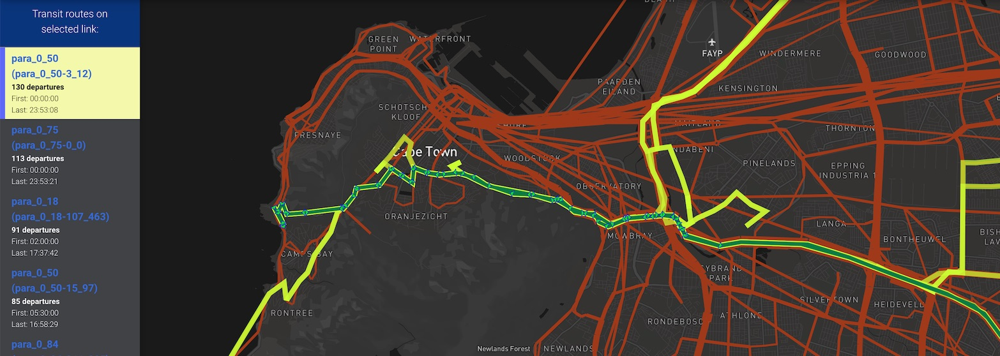

_Transit routes_

This viz shows transit route details.

## Usage

No YAML is required. If the run folder contains a `*output_transitSchedule.xml.gz` file, then this view will be available and the transit route supply can be explored.

If the run folder also contains `*pt_stop2stop_departures.csv.gz` then the transit ridership (demand) will also be loaded. This may take a few seconds.

### Exploring transit

Click on any transit link to see the list of transit routes which traverse that link. You can select any individual route from the details panel to see the extent of the route.
