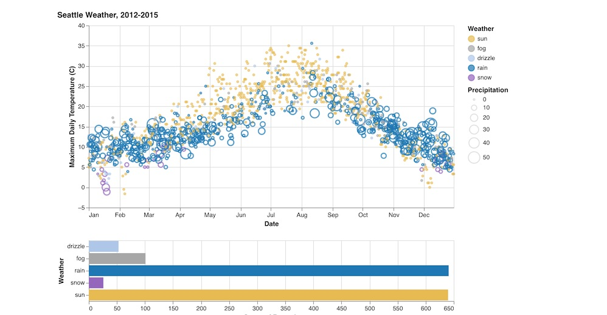

_Scatterplot and horizontal box plot_

[Vega-Lite](https://vega.github.io/vega-lite/) is an interactive charting library that uses a well-regarded declarative syntax for defining charts known as "Grammar of Graphics".

See the Vega-Lite website for many examples of typical data visualizations that are possible: the usual bar-charts, scatterplots, and much more are possible.

**NOTE:** For simple bar, area, and line charts, you will probably be better off using the simple charts defined in [Bar, Area, and Line Charts](bar-area-line)

## Usage

A file named `*.vega.json` must be present in working folder. Each json file matching that pattern will produce a separate Vega-Lite diagram.

**DATA** can either be an array of hard-coded values (see `example.vega.json`) or a URL pointing to a file containing an array of JSON or CSV data as in `movies.vega.json`. The file format is guessed based on the file extension.

See [Data in Vega](https://vega.github.io/vega-lite/docs/data.html) for the full story on what data types are supported by Vega.

- If the URL is pointing to a file in the local filestorage, the plugin will load it directly and embed the data in the object automatically.
- If the URL is a fully-qualified URL, the Vega library will load it on its own.

**AUTOSIZE** must be set as in the example below for the charts to be responsive to window size changes.

**WIDTH** and **HEIGHT** can be hardcoded to pixel sizes, but a width set to `container` will be responsive. Height needs to be specified.

---

**example.vega.json**

```json
{
  "$schema": "https://vega.github.io/schema/vega-lite/v4.json",
  "data": { "url": "movies.json" },
  "transform": [
    {
      "filter": {
        "and": [
          { "field": "IMDB Rating", "valid": true },
          { "field": "Rotten Tomatoes Rating", "valid": true }
        ]
      }
    }
  ],
  "mark": "rect",
  "width": "container",
  "height": 300,
  "autosize": { "type": "fit", "resize": true },
  "encoding": {
    "x": {
      "bin": { "maxbins": 60 },
      "field": "IMDB Rating",
      "type": "quantitative"
    },
    "y": {
      "bin": { "maxbins": 40 },
      "field": "Rotten Tomatoes Rating",
      "type": "quantitative"
    },
    "color": {
      "aggregate": "count",
      "type": "quantitative"
    }
  },
  "config": {
    "view": {
      "stroke": "transparent"
    }
  }
}
```
