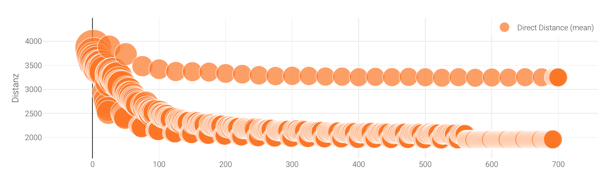

_A "bubble" plot, a type of scatterplot where the circle sizes are variable_

Scatterplots and bubble plots allow you to plot data on two independent axes.

## Usage

Scatterplots can only be included as panels in **Dashboards**. See Dashboard documentation for general tips on creating dashboard configurations.

- Each chart panel is defined inside a **row** in a `dashboard-*.yaml` file.
- Choose from panel types `scatter` and `bubble` in the dashboard configuration.
- Standard title, description, and width fields define the frame.

---

### Sample dashboard.yaml config snippet

```yaml
layout:
  row1:
    - type: "scatter"
      title: "Y vs. X"
      description: "a scatterplot"
      width: 3
      props:
        dataset: "*drt_customer_stats.csv"
        x: "iteration"
        usedCol: [distance]
        legendName: ["Distance (mean)"]
        xAxisName: "Iteration"
        yAxisName: "Distance, m"
        markerSize: 5

    - type: "bubble"
      title: "Y vs. X"
      description: "a bubbley scatterplot"
      width: 2
      props:
        dataset: "*drt_customer_stats.csv"
        x: "iteration"
        y: "distance_mean"
        bubble: "directDistance"
        factor: 100
        legendName: ["Distance (mean)"]
        markerSize: 5
        skipFirstRow: false
        xAxisName: "Iteration"
        yAxisName: "Distance, m"
```

---

### Scatterplot and bubbleplot properties

**dataset:** (Required) String. The filepath containing the data. May include wildcards \* and ?.

**x:** String. The column containing x-values.

**y:** String. The column containing y-values.

**bubble:** String. The column containing bubble size values.

**legendName:** Array of strings. Legend titles for each line. The column names will be used if this is omitted.

**xAxisName/yAxisName:** Labels for the axes.
