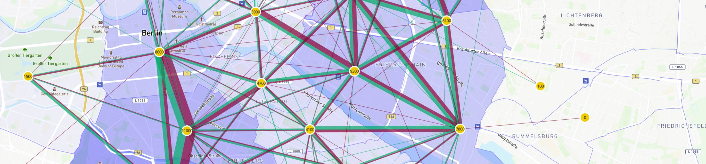

### Episim: COVID-19 virus spreading dynamics

This animation illustrates the [MATSIM-Episim model](https://covid-sim.info) as it simulates the spread of COVID-19 disease through **Berlin, Germany** and the surrounding area.

Each dot depicts a person, going about their day. The colors represent their disease status:

&nbsp;&nbsp;&nbsp;&nbsp; Susceptible and healthy

&nbsp;&nbsp;&nbsp;&nbsp;
    Latently Infected

&nbsp;&nbsp;&nbsp;&nbsp;
    Contagious

&nbsp;&nbsp;&nbsp;&nbsp;
    Showing Symptoms

&nbsp;&nbsp;&nbsp;&nbsp;
    Seriously Sick

&nbsp;&nbsp;&nbsp;&nbsp;
    Critical

&nbsp;&nbsp;&nbsp;&nbsp;
    Recovered

You can select different days to see how the population's health shifts over time.

This is a "Base Case" simulation for illustrative purposes. It shows what would have happened in Berlin if there had been no social distancing measures, no closing of schools and workplaces, etc.

This illustration shows only a small sample of the total tripmaking in Berlin; while MATSim-Episim can model each agent individually, it is too much data to show on one screen in disaggregate form.

### Interesting things to explore

- By day 14, new infections &nbsp;&nbsp;&nbsp;&nbsp; are quite noticeable throughout Berlin, and by day 18 they are everywhere in the city

- By day 33, many recovered people &nbsp;&nbsp;&nbsp;&nbsp; are apparent
- By day 40, most of the new infections occur far outside the central urban area of Berlin.

### How does the simulation work?

The method used by MATSIM-Episim is available on the front page at <https://matsim-vsp.github.io>. It is based on advanced human mobility models and virus infection dynamics taken from recent literature and publications.

### For more information

Please email us at [covid19@vsp.tu-berlin.de](mailto:covid19@vsp.tu-berlin.de) for more information.

The main website is at [matsim-vsp.github.io](https://covid-sim.info) is under heavy development as we build new versions of the Episim model.

MATSim-Episim is freely available and open source, and can be downloaded at <https://github.com/matsim-org/matsim-episim>.

### Acknowledgements

This site and the MATSim-Episim model are developed at Technische Universität Berlin, by the Transport Systems Planning and Transport Telematics group, Institute for Land and Sea Transport (ILS) at TU Berlin. Professor Kai Nagel leads the team.

This research supported by the [Bundesministerium für Bildung und Forschung](https://bmbf.de) at the German Federal Goverment.

Website and visulations built using [Vue](https://vuejs.org) and [Three.js](https://threejs.org).

 
 

 
 
 
 
